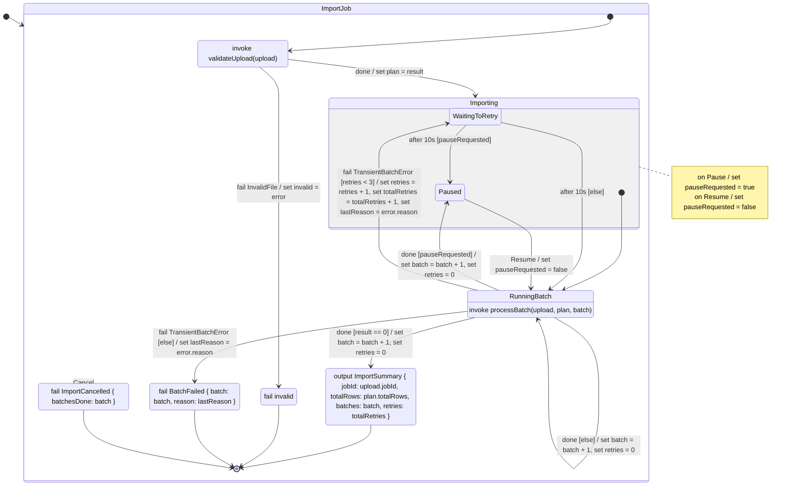

## ImportJob

`examples/import-job/import.road:9`

```text
A CSV import: validate the file, then import it batch by batch.
The operator can pause, resume and cancel it while it runs.
```


```mermaid
stateDiagram-v2
  [*] --> ImportJob_machine
  state "ImportJob" as ImportJob_machine
  state ImportJob_machine {
    Validating: invoke validateUpload(upload)
    state Importing {
      state "RunningBatch" as Importing_RunningBatch
      Importing_RunningBatch: invoke processBatch(upload, plan, batch)
      state "WaitingToRetry" as Importing_WaitingToRetry
      state "Paused" as Importing_Paused
      [*] --> Importing_RunningBatch
      Importing_RunningBatch --> Importing_Paused: done [pauseRequested] / set batch = batch + 1, set retries = 0
      Importing_RunningBatch --> Importing_RunningBatch: done [else] / set batch = batch + 1, set retries = 0
      Importing_RunningBatch --> Importing_WaitingToRetry: fail TransientBatchError [retries < 3] / set retries = retries + 1, set totalRetries = totalRetries + 1, set lastReason = error.reason
      Importing_WaitingToRetry --> Importing_Paused: after 10s [pauseRequested]
      Importing_WaitingToRetry --> Importing_RunningBatch: after 10s [else]
      Importing_Paused --> Importing_RunningBatch: Resume / set pauseRequested = false
    }
    note right of Importing
      on Pause / set pauseRequested = true
      on Resume / set pauseRequested = false
    end note
    Completed: output ImportSummary { jobId#58; upload.jobId, totalRows#58; plan.totalRows, batches#58; batch, retries#58; totalRetries }
    Rejected: fail invalid
    Failed: fail BatchFailed { batch#58; batch, reason#58; lastReason }
    Cancelled: fail ImportCancelled { batchesDone#58; batch }
    [*] --> Validating
    Validating --> Importing: done / set plan = result
    Validating --> Rejected: fail InvalidFile / set invalid = error
    Importing_RunningBatch --> Completed: done [result == 0] / set batch = batch + 1, set retries = 0
    Importing_RunningBatch --> Failed: fail TransientBatchError [else] / set lastReason = error.reason
    Completed --> [*]
    Rejected --> [*]
    Failed --> [*]
    Cancelled --> [*]
  }
  ImportJob_machine --> Cancelled: Cancel
```
