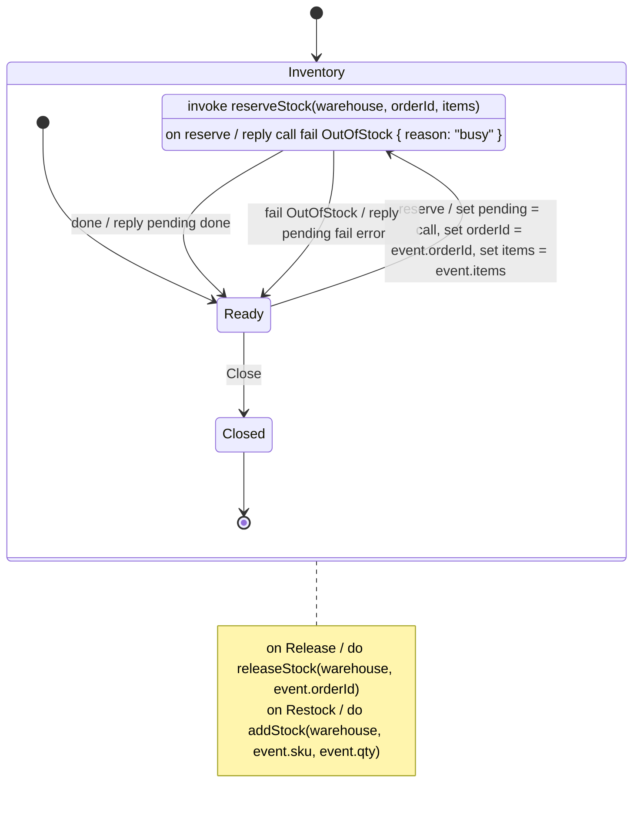

## Inventory

`examples/inventory/inventory.road:18`

```text
The stock of one warehouse, shared by every order. An order calls `reserve`, and the answer
goes to that order alone.
```


```mermaid
stateDiagram-v2
  [*] --> Inventory_machine
  state "Inventory" as Inventory_machine
  state Inventory_machine {
    Reserving: invoke reserveStock(warehouse, orderId, items)
    Reserving: on reserve / reply call fail OutOfStock { reason#58; "busy" }
    [*] --> Ready
    Ready --> Reserving: reserve / set pending = call, set orderId = event.orderId, set items = event.items
    Ready --> Closed: Close
    Reserving --> Ready: done / reply pending done
    Reserving --> Ready: fail OutOfStock / reply pending fail error
    Closed --> [*]
  }
  note right of Inventory_machine
    on Release / do releaseStock(warehouse, event.orderId)
    on Restock / do addStock(warehouse, event.sku, event.qty)
  end note
```
