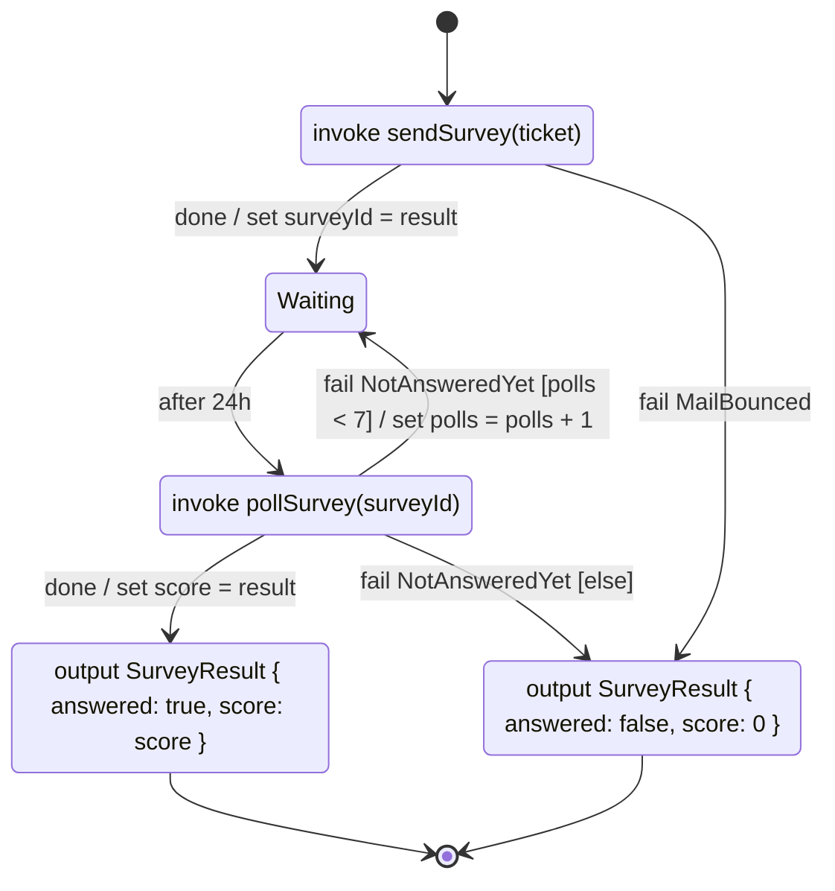

## SatisfactionSurvey

`examples/large/survey.road:4`

```text
Send a satisfaction survey and wait up to a week for the answer.
```


```mermaid
stateDiagram-v2
  Sending: invoke sendSurvey(ticket)
  Polling: invoke pollSurvey(surveyId)
  Answered: output SurveyResult { answered#58; true, score#58; score }
  NoAnswer: output SurveyResult { answered#58; false, score#58; 0 }
  [*] --> Sending
  Sending --> Waiting: done / set surveyId = result
  Sending --> NoAnswer: fail MailBounced
  Waiting --> Polling: after 24h
  Polling --> Answered: done / set score = result
  Polling --> Waiting: fail NotAnsweredYet [polls < 7] / set polls = polls + 1
  Polling --> NoAnswer: fail NotAnsweredYet [else]
  Answered --> [*]
  NoAnswer --> [*]
```
