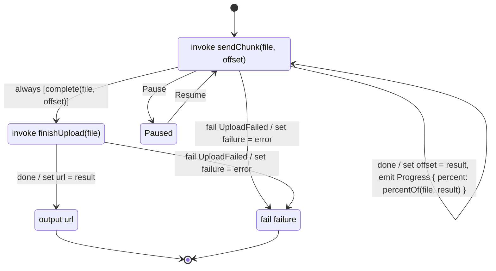

## Upload

`examples/upload/upload.road:23`

```text
Upload a file in chunks. Can be paused, and reports its progress to whoever invoked it.
```


```mermaid
stateDiagram-v2
  Sending: invoke sendChunk(file, offset)
  Finishing: invoke finishUpload(file)
  Done: output url
  Failed: fail failure
  [*] --> Sending
  Sending --> Finishing: always [complete(file, offset)]
  Sending --> Sending: done / set offset = result, emit Progress { percent#58; percentOf(file, result) }
  Sending --> Failed: fail UploadFailed / set failure = error
  Sending --> Paused: Pause
  Paused --> Sending: Resume
  Finishing --> Done: done / set url = result
  Finishing --> Failed: fail UploadFailed / set failure = error
  Done --> [*]
  Failed --> [*]
```
