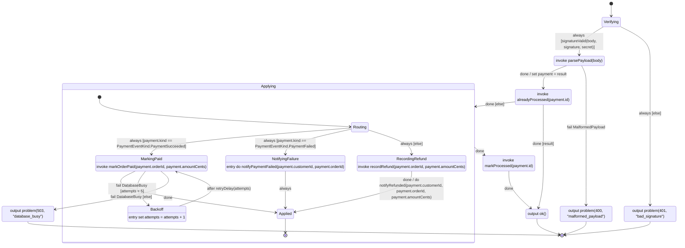

## PaymentWebhook

`examples/webhook/webhook.road:11`

```text
The payment provider's webhook: verify, parse, deduplicate, apply, acknowledge.
Every final state is one HTTP response.
```


```mermaid
stateDiagram-v2
  Parsing: invoke parsePayload(body)
  CheckingDuplicate: invoke alreadyProcessed(payment.id)
  state Applying {
    state "Routing" as Applying_Routing
    state "MarkingPaid" as Applying_MarkingPaid
    Applying_MarkingPaid: invoke markOrderPaid(payment.orderId, payment.amountCents)
    state "Backoff" as Applying_Backoff
    Applying_Backoff: entry set attempts = attempts + 1
    state "NotifyingFailure" as Applying_NotifyingFailure
    Applying_NotifyingFailure: entry do notifyPaymentFailed(payment.customerId, payment.orderId)
    state "RecordingRefund" as Applying_RecordingRefund
    Applying_RecordingRefund: invoke recordRefund(payment.orderId, payment.amountCents)
    state "Applied" as Applying_Applied
    [*] --> Applying_Routing
    Applying_Routing --> Applying_MarkingPaid: always [payment.kind == PaymentEventKind.PaymentSucceeded]
    Applying_Routing --> Applying_NotifyingFailure: always [payment.kind == PaymentEventKind.PaymentFailed]
    Applying_Routing --> Applying_RecordingRefund: always [else]
    Applying_MarkingPaid --> Applying_Applied: done
    Applying_MarkingPaid --> Applying_Backoff: fail DatabaseBusy [attempts < 5]
    Applying_Backoff --> Applying_MarkingPaid: after retryDelay(attempts)
    Applying_NotifyingFailure --> Applying_Applied: always
    Applying_RecordingRefund --> Applying_Applied: done / do notifyRefunded(payment.customerId, payment.orderId, payment.amountCents)
    Applying_Applied --> [*]
  }
  MarkingProcessed: invoke markProcessed(payment.id)
  Acknowledged: output ok()
  BadSignature: output problem(401, "bad_signature")
  Malformed: output problem(400, "malformed_payload")
  Unavailable: output problem(503, "database_busy")
  [*] --> Verifying
  Verifying --> Parsing: always [signatureValid(body, signature, secret)]
  Verifying --> BadSignature: always [else]
  Parsing --> CheckingDuplicate: done / set payment = result
  Parsing --> Malformed: fail MalformedPayload
  CheckingDuplicate --> Acknowledged: done [result]
  CheckingDuplicate --> Applying: done [else]
  Applying --> MarkingProcessed: done
  Applying_MarkingPaid --> Unavailable: fail DatabaseBusy [else]
  MarkingProcessed --> Acknowledged: done
  Acknowledged --> [*]
  BadSignature --> [*]
  Malformed --> [*]
  Unavailable --> [*]
```
