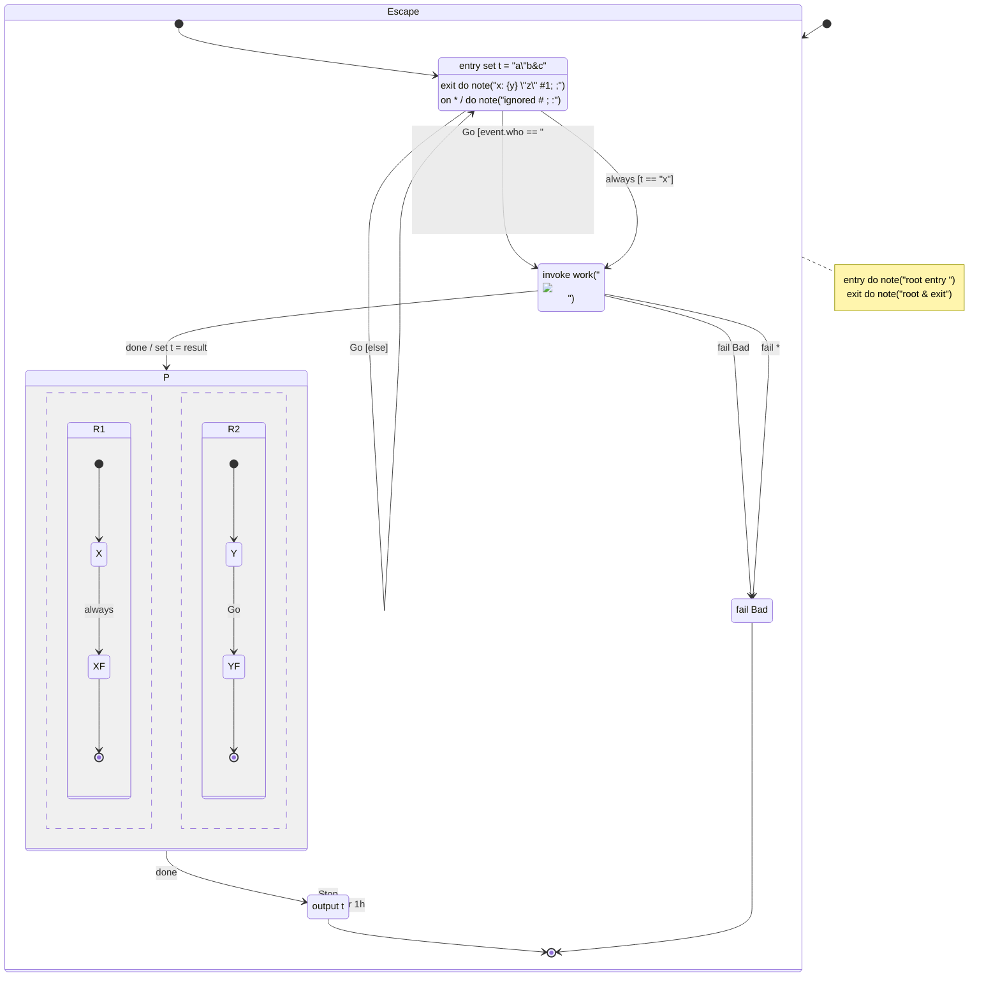

## Escape

`packages/viewer/test/charts/escape.road:12`

```text
Doc </script><script>alert('doc')</script>  & "quotes" 'single'
second line <!-- comment
```


```mermaid
stateDiagram-v2
  [*] --> Escape_machine
  state "Escape" as Escape_machine
  state Escape_machine {
    A: entry set t = "a\"b&c<d>"
    A: exit do note("x#58; {y} \"z\" #35;1#59; #59;")
    A: on * / do note("ignored #35; #59; #58;")
    B: invoke work("<img src=x onerror=alert(7)>")
    state P {
      state "R1" as P_R1
      state P_R1 {
        state "X" as P_R1_X
        state "XF" as P_R1_XF
        [*] --> P_R1_X
        P_R1_X --> P_R1_XF: always
        P_R1_XF --> [*]
      }
      --
      state "R2" as P_R2
      state P_R2 {
        state "Y" as P_R2_Y
        state "YF" as P_R2_YF
        [*] --> P_R2_Y
        P_R2_Y --> P_R2_YF: Go
        P_R2_YF --> [*]
      }
    }
    Done: output t
    Failed: fail Bad
    [*] --> A
    A --> B: Go [event.who == "</script><svg onload=alert(6)>"] / do note("{curly}#58; colon")
    A --> A: Go [else]
    A --> B: always [t == "x"]
    B --> P: done / set t = result
    B --> Failed: fail Bad
    B --> Failed: fail *
    P --> Done: done
    Done --> [*]
    Failed --> [*]
  }
  note right of Escape_machine
    entry do note("root entry </script>")
    exit do note("root & exit")
  end note
  Escape_machine --> Done: Stop
  Escape_machine --> Done: after 1h
```
