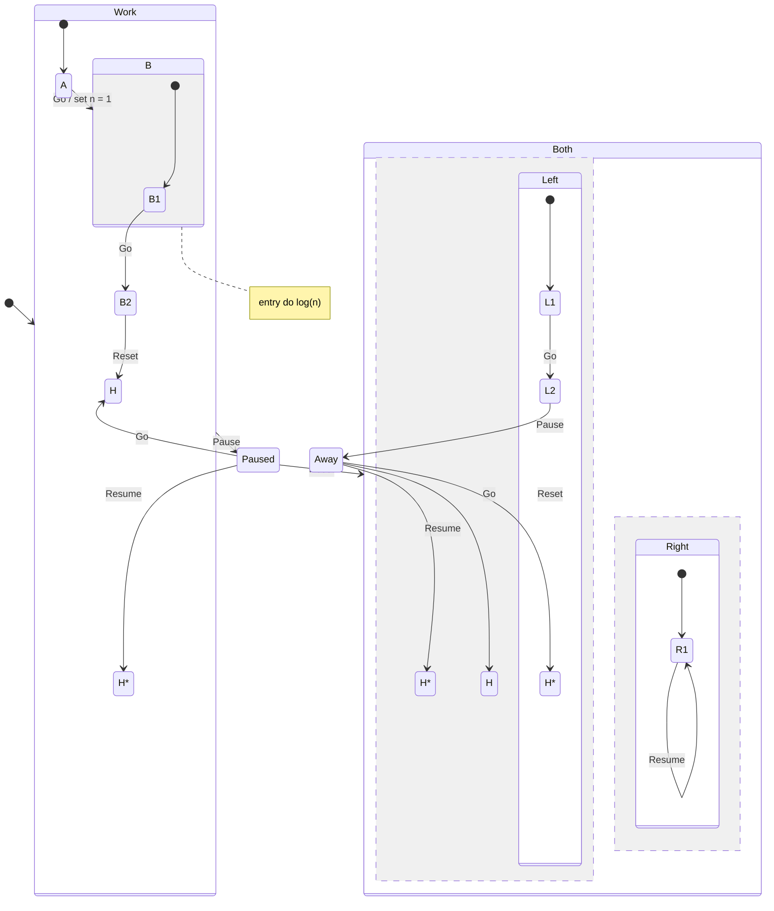

## Histories

`packages/viewer/test/charts/history.road:7`

```text
History states drawn as circles inside their parents.
```


```mermaid
stateDiagram-v2
  state Work {
    state "H" as Work_Last
    state "H*" as Work_All
    state "A" as Work_A
    state "B" as Work_B
    state Work_B {
      state "B1" as Work_B_B1
      state "B2" as Work_B_B2
      [*] --> Work_B_B1
      Work_B_B1 --> Work_B_B2: Go
    }
    note right of Work_B
      entry do log(n)
    end note
    [*] --> Work_A
    Work_A --> Work_B: Go / set n = 1
    Work_B_B2 --> Work_Last: Reset
  }
  state Both {
    state "H*" as Both_Again
    state "H" as Both_Regions
    state "Left" as Both_Left
    state Both_Left {
      state "H*" as Both_Left_Inside
      state "L1" as Both_Left_L1
      state "L2" as Both_Left_L2
      [*] --> Both_Left_L1
      Both_Left_L1 --> Both_Left_L2: Go
    }
    --
    state "Right" as Both_Right
    state Both_Right {
      state "R1" as Both_Right_R1
      [*] --> Both_Right_R1
      Both_Right_R1 --> Both_Right_R1: Resume
    }
  }
  [*] --> Work
  Work --> Paused: Pause
  Paused --> Work_All: Resume
  Paused --> Work_Last: Go
  Paused --> Both: Reset
  Both_Left_L2 --> Away: Pause
  Away --> Both_Again: Resume
  Away --> Both_Regions: Go
  Away --> Both_Left_Inside: Reset
```
