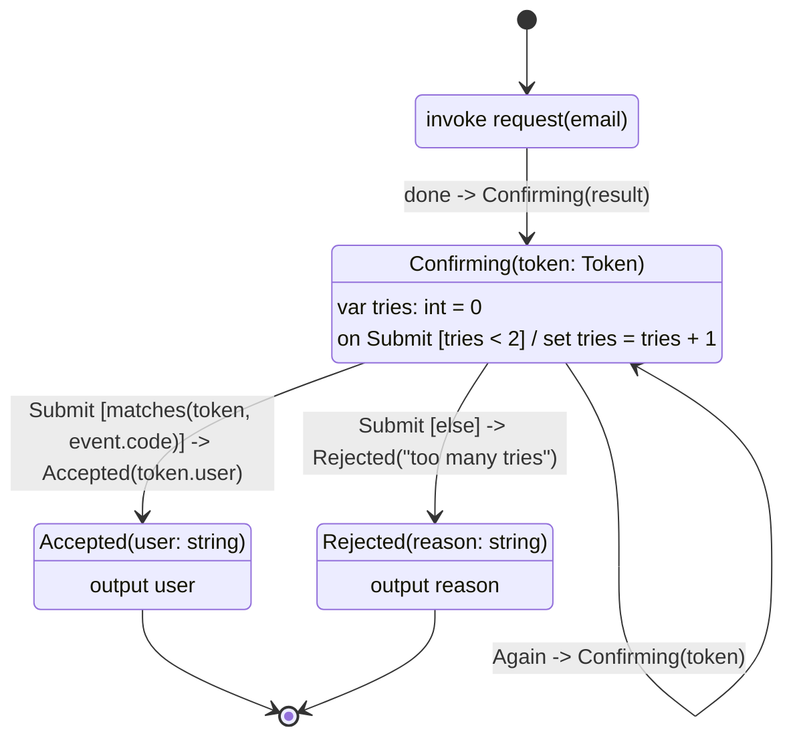

## Confirm

`packages/viewer/test/charts/locals.road:10`

```text
A token that lives only in the states that need it.
```


```mermaid
stateDiagram-v2
  Requesting: invoke request(email)
  state "Confirming(token#58; Token)" as Confirming
  Confirming: var tries#58; int = 0
  Confirming: on Submit [tries < 2] / set tries = tries + 1
  state "Accepted(user#58; string)" as Accepted
  Accepted: output user
  state "Rejected(reason#58; string)" as Rejected
  Rejected: output reason
  [*] --> Requesting
  Requesting --> Confirming: done -> Confirming(result)
  Confirming --> Accepted: Submit [matches(token, event.code)] -> Accepted(token.user)
  Confirming --> Rejected: Submit [else] -> Rejected("too many tries")
  Confirming --> Confirming: Again -> Confirming(token)
  Accepted --> [*]
  Rejected --> [*]
```
