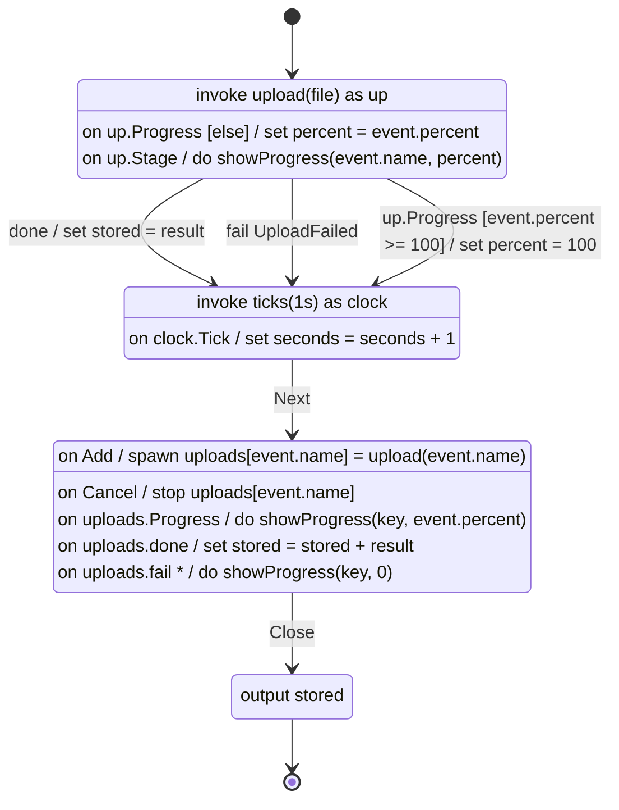

## Uploads

`packages/viewer/test/charts/tasks.road:19`

```text
Uploads one file and then many, counting the seconds it waits in between.
```


```mermaid
stateDiagram-v2
  Single: invoke upload(file) as up
  Single: on up.Progress [else] / set percent = event.percent
  Single: on up.Stage / do showProgress(event.name, percent)
  Waiting: invoke ticks(1s) as clock
  Waiting: on clock.Tick / set seconds = seconds + 1
  Many: on Add / spawn uploads[event.name] = upload(event.name)
  Many: on Cancel / stop uploads[event.name]
  Many: on uploads.Progress / do showProgress(key, event.percent)
  Many: on uploads.done / set stored = stored + result
  Many: on uploads.fail * / do showProgress(key, 0)
  Closed: output stored
  [*] --> Single
  Single --> Waiting: done / set stored = result
  Single --> Waiting: fail UploadFailed
  Single --> Waiting: up.Progress [event.percent >= 100] / set percent = 100
  Waiting --> Many: Next
  Many --> Closed: Close
  Closed --> [*]
```
