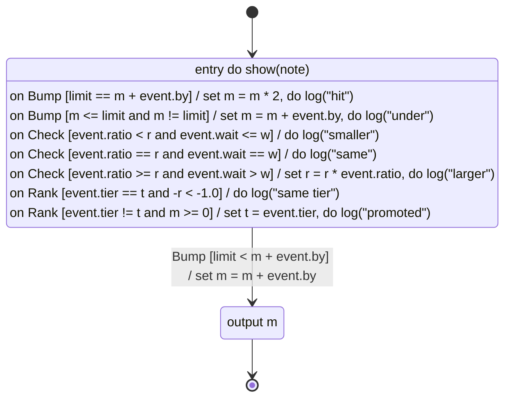

## Aliases

`spec/conformance/charts/alias.road:19`

```text
Counts up to a limit, comparing what it is sent with what it holds.
```


```mermaid
stateDiagram-v2
  Counting: entry do show(note)
  Counting: on Bump [limit == m + event.by] / set m = m * 2, do log("hit")
  Counting: on Bump [m <= limit and m != limit] / set m = m + event.by, do log("under")
  Counting: on Check [event.ratio < r and event.wait <= w] / do log("smaller")
  Counting: on Check [event.ratio == r and event.wait == w] / do log("same")
  Counting: on Check [event.ratio >= r and event.wait > w] / set r = r * event.ratio, do log("larger")
  Counting: on Rank [event.tier == t and -r < -1.0] / do log("same tier")
  Counting: on Rank [event.tier != t and m >= 0] / set t = event.tier, do log("promoted")
  Done: output m
  [*] --> Counting
  Counting --> Done: Bump [limit < m + event.by] / set m = m + event.by
  Done --> [*]
```
