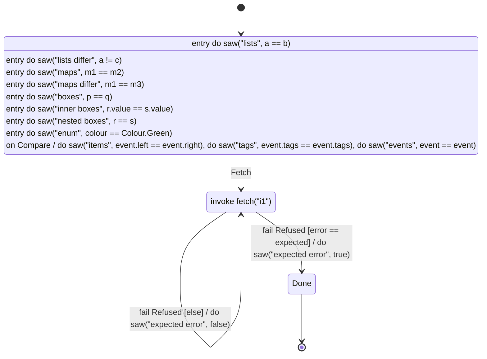

## Equality

`spec/conformance/charts/equality.road:20`

```text
Compares its inputs, then the items of events, then a task's result and
errors against the ones it expects.
```


```mermaid
stateDiagram-v2
  Comparing: entry do saw("lists", a == b)
  Comparing: entry do saw("lists differ", a != c)
  Comparing: entry do saw("maps", m1 == m2)
  Comparing: entry do saw("maps differ", m1 == m3)
  Comparing: entry do saw("boxes", p == q)
  Comparing: entry do saw("inner boxes", r.value == s.value)
  Comparing: entry do saw("nested boxes", r == s)
  Comparing: entry do saw("enum", colour == Colour.Green)
  Comparing: on Compare / do saw("items", event.left == event.right), do saw("tags", event.tags == event.tags), do saw("events", event == event)
  Fetching: invoke fetch("i1")
  [*] --> Comparing
  Comparing --> Fetching: Fetch
  Fetching --> Fetching: done / do saw("item", result == item)
  Fetching --> Done: fail Refused [error == expected] / do saw("expected error", true)
  Fetching --> Fetching: fail Refused [else] / do saw("expected error", false)
  Done --> [*]
```
