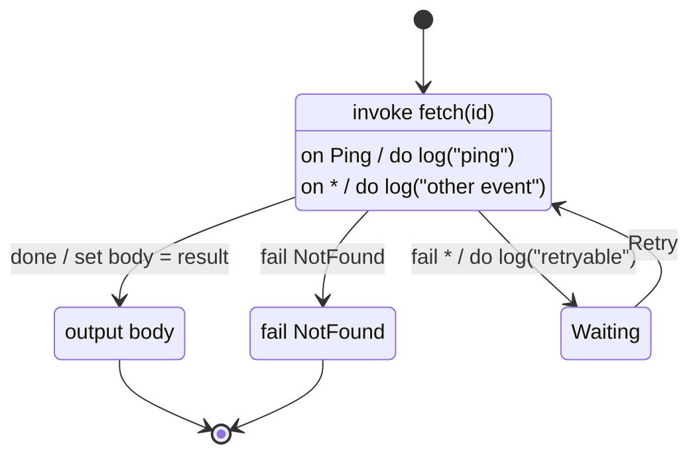

## Fetch

`spec/conformance/charts/fetch.road:11`

```text
Fetch a document. Errors other than NotFound wait for a retry.
```


```mermaid
stateDiagram-v2
  Loading: invoke fetch(id)
  Loading: on Ping / do log("ping")
  Loading: on * / do log("other event")
  Loaded: output body
  Missing: fail NotFound
  [*] --> Loading
  Loading --> Loaded: done / set body = result
  Loading --> Missing: fail NotFound
  Loading --> Waiting: fail * / do log("retryable")
  Waiting --> Loading: Retry
  Loaded --> [*]
  Missing --> [*]
```
