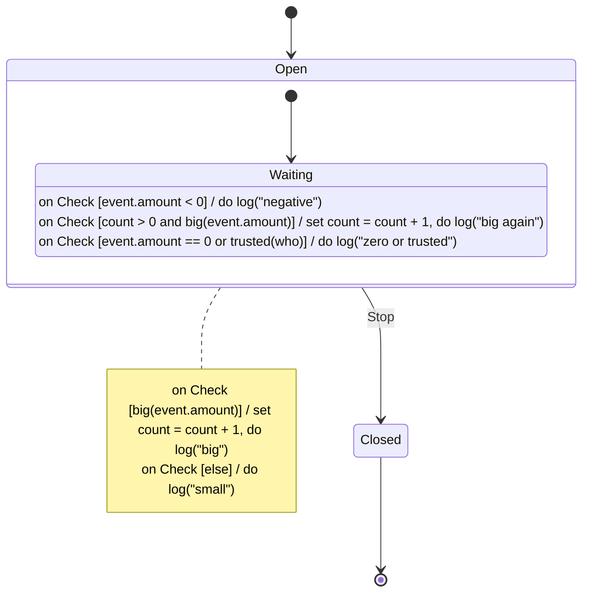

## Gate

`spec/conformance/charts/gate.road:9`

```text
Classify amounts until stopped.
```


```mermaid
stateDiagram-v2
  state Open {
    state "Waiting" as Open_Waiting
    Open_Waiting: on Check [event.amount < 0] / do log("negative")
    Open_Waiting: on Check [count > 0 and big(event.amount)] / set count = count + 1, do log("big again")
    Open_Waiting: on Check [event.amount == 0 or trusted(who)] / do log("zero or trusted")
    [*] --> Open_Waiting
  }
  note right of Open
    on Check [big(event.amount)] / set count = count + 1, do log("big")
    on Check [else] / do log("small")
  end note
  [*] --> Open
  Open --> Closed: Stop
  Closed --> [*]
```
