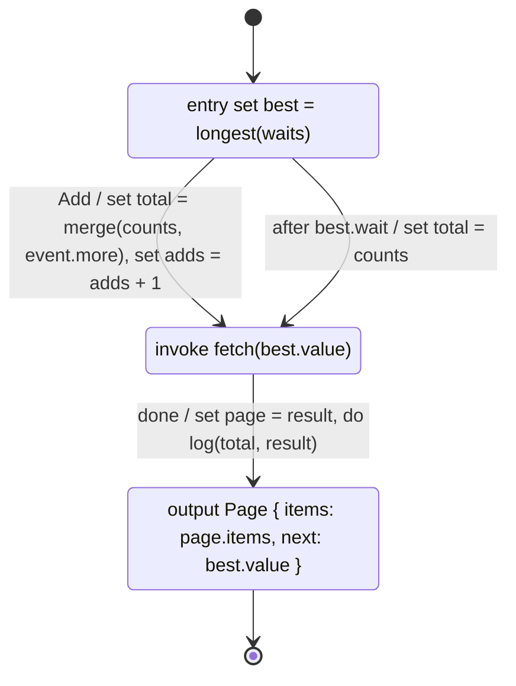

## Gather

`spec/conformance/charts/generic.road:24`

```text
Waits for more counts or for the longest wait, then fetches a page after the
longest one.
```


```mermaid
stateDiagram-v2
  Waiting: entry set best = longest(waits)
  Fetching: invoke fetch(best.value)
  Done: output Page { items#58; page.items, next#58; best.value }
  [*] --> Waiting
  Waiting --> Fetching: Add / set total = merge(counts, event.more), set adds = adds + 1
  Waiting --> Fetching: after best.wait / set total = counts
  Fetching --> Done: done / set page = result, do log(total, result)
  Done --> [*]
```
