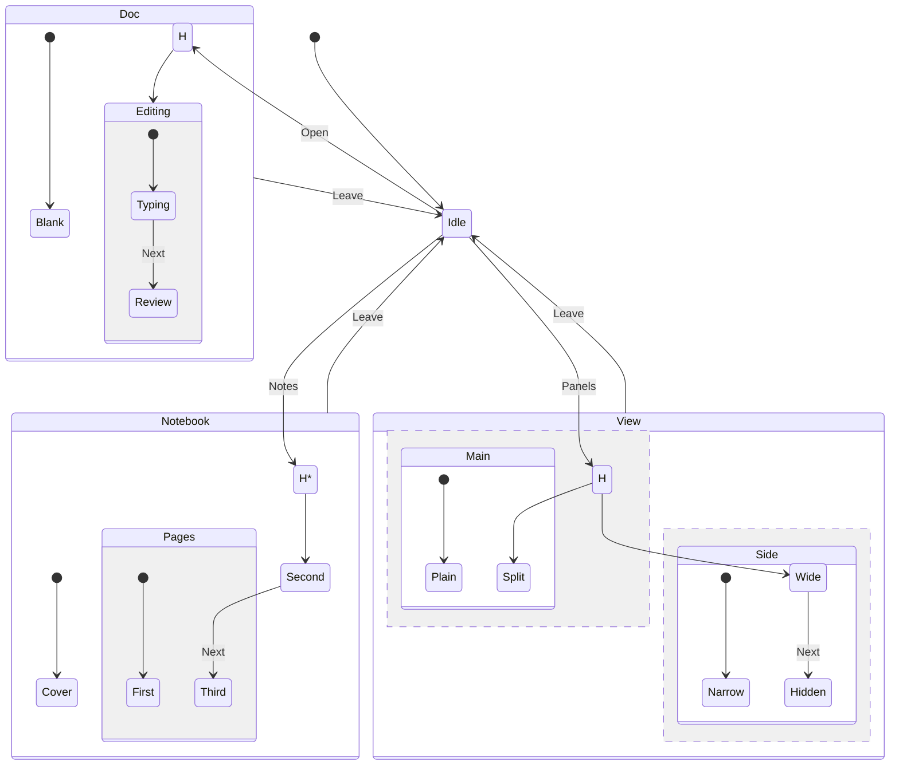

## Editor

`spec/conformance/charts/history-default.road:6`

```text
A shallow default, a deep one through the state above it, and several in
the regions of a parallel state.
```


```mermaid
stateDiagram-v2
  state Doc {
    state "H" as Doc_Previous
    state "Blank" as Doc_Blank
    state "Editing" as Doc_Editing
    state Doc_Editing {
      state "Typing" as Doc_Editing_Typing
      state "Review" as Doc_Editing_Review
      [*] --> Doc_Editing_Typing
      Doc_Editing_Typing --> Doc_Editing_Review: Next
    }
    [*] --> Doc_Blank
    Doc_Previous --> Doc_Editing
  }
  state Notebook {
    state "H*" as Notebook_Last
    state "Cover" as Notebook_Cover
    state "Pages" as Notebook_Pages
    state Notebook_Pages {
      state "First" as Notebook_Pages_First
      state "Second" as Notebook_Pages_Second
      state "Third" as Notebook_Pages_Third
      [*] --> Notebook_Pages_First
      Notebook_Pages_Second --> Notebook_Pages_Third: Next
    }
    [*] --> Notebook_Cover
    Notebook_Last --> Notebook_Pages_Second
  }
  state View {
    state "H" as View_Restore
    state "Main" as View_Main
    state View_Main {
      state "Plain" as View_Main_Plain
      state "Split" as View_Main_Split
      [*] --> View_Main_Plain
    }
    --
    state "Side" as View_Side
    state View_Side {
      state "Narrow" as View_Side_Narrow
      state "Wide" as View_Side_Wide
      state "Hidden" as View_Side_Hidden
      [*] --> View_Side_Narrow
      View_Side_Wide --> View_Side_Hidden: Next
    }
  }
  [*] --> Idle
  Idle --> Doc_Previous: Open
  Idle --> Notebook_Last: Notes
  Idle --> View_Restore: Panels
  Doc --> Idle: Leave
  Notebook --> Idle: Leave
  View --> Idle: Leave
  View_Restore --> View_Main_Split
  View_Restore --> View_Side_Wide
```
