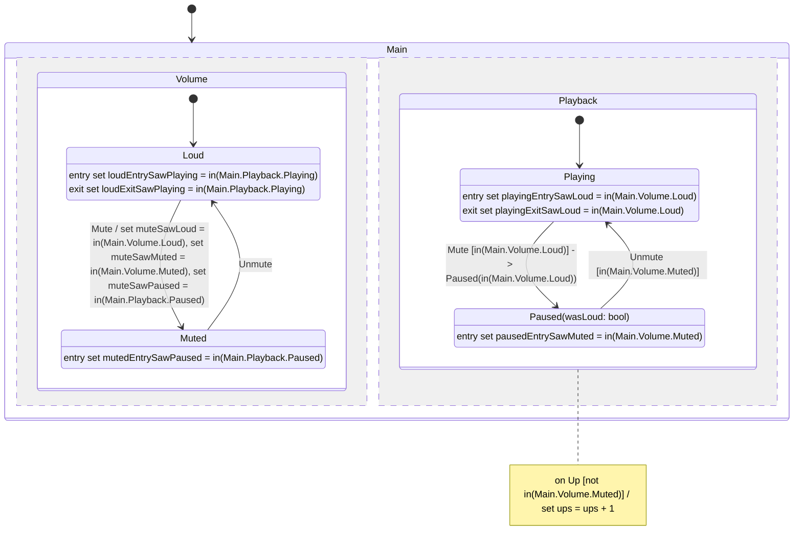

## Jukebox

`spec/conformance/charts/in-state.road:6`

```text
A player whose two regions ask about each other.
```


```mermaid
stateDiagram-v2
  state Main {
    state "Volume" as Main_Volume
    state Main_Volume {
      state "Loud" as Main_Volume_Loud
      Main_Volume_Loud: entry set loudEntrySawPlaying = in(Main.Playback.Playing)
      Main_Volume_Loud: exit set loudExitSawPlaying = in(Main.Playback.Playing)
      state "Muted" as Main_Volume_Muted
      Main_Volume_Muted: entry set mutedEntrySawPaused = in(Main.Playback.Paused)
      [*] --> Main_Volume_Loud
      Main_Volume_Loud --> Main_Volume_Muted: Mute / set muteSawLoud = in(Main.Volume.Loud), set muteSawMuted = in(Main.Volume.Muted), set muteSawPaused = in(Main.Playback.Paused)
      Main_Volume_Muted --> Main_Volume_Loud: Unmute
    }
    --
    state "Playback" as Main_Playback
    state Main_Playback {
      state "Playing" as Main_Playback_Playing
      Main_Playback_Playing: entry set playingEntrySawLoud = in(Main.Volume.Loud)
      Main_Playback_Playing: exit set playingExitSawLoud = in(Main.Volume.Loud)
      state "Paused(wasLoud#58; bool)" as Main_Playback_Paused
      Main_Playback_Paused: entry set pausedEntrySawMuted = in(Main.Volume.Muted)
      [*] --> Main_Playback_Playing
      Main_Playback_Playing --> Main_Playback_Paused: Mute [in(Main.Volume.Loud)] -> Paused(in(Main.Volume.Loud))
      Main_Playback_Paused --> Main_Playback_Playing: Unmute [in(Main.Volume.Muted)]
    }
    note right of Main_Playback
      on Up [not in(Main.Volume.Muted)] / set ups = ups + 1
    end note
  }
  [*] --> Main
```
