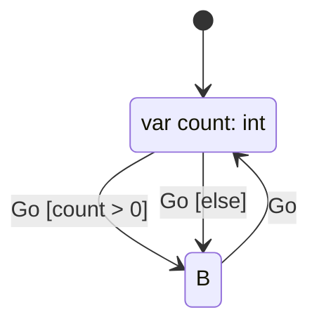

## Unset

`spec/conformance/charts/locals-defects.road:5`

```text
A state variable with no initial value, read by a guard before anything assigns it.
```


```mermaid
stateDiagram-v2
  A: var count#58; int
  [*] --> A
  A --> B: Go [count > 0]
  A --> B: Go [else]
  B --> A: Go
```
