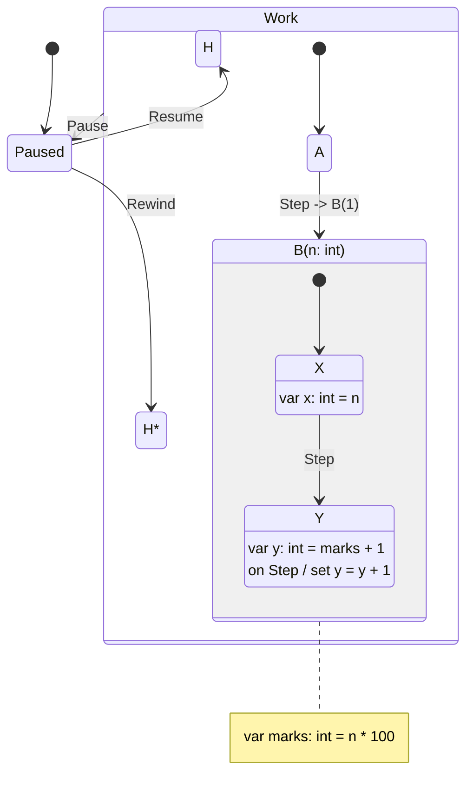

## Hist

`spec/conformance/charts/locals-history.road:4`

```text
History states that keep the locals of the states they re-enter.
```


```mermaid
stateDiagram-v2
  state Work {
    state "H" as Work_Back
    state "H*" as Work_All
    state "A" as Work_A
    state "B(n#58; int)" as Work_B
    state Work_B {
      state "X" as Work_B_X
      Work_B_X: var x#58; int = n
      state "Y" as Work_B_Y
      Work_B_Y: var y#58; int = marks + 1
      Work_B_Y: on Step / set y = y + 1
      [*] --> Work_B_X
      Work_B_X --> Work_B_Y: Step
    }
    note right of Work_B
      var marks#58; int = n * 100
    end note
    [*] --> Work_A
    Work_A --> Work_B: Step -> B(1)
  }
  [*] --> Paused
  Paused --> Work_Back: Resume
  Paused --> Work_All: Rewind
  Work --> Paused: Pause
```
