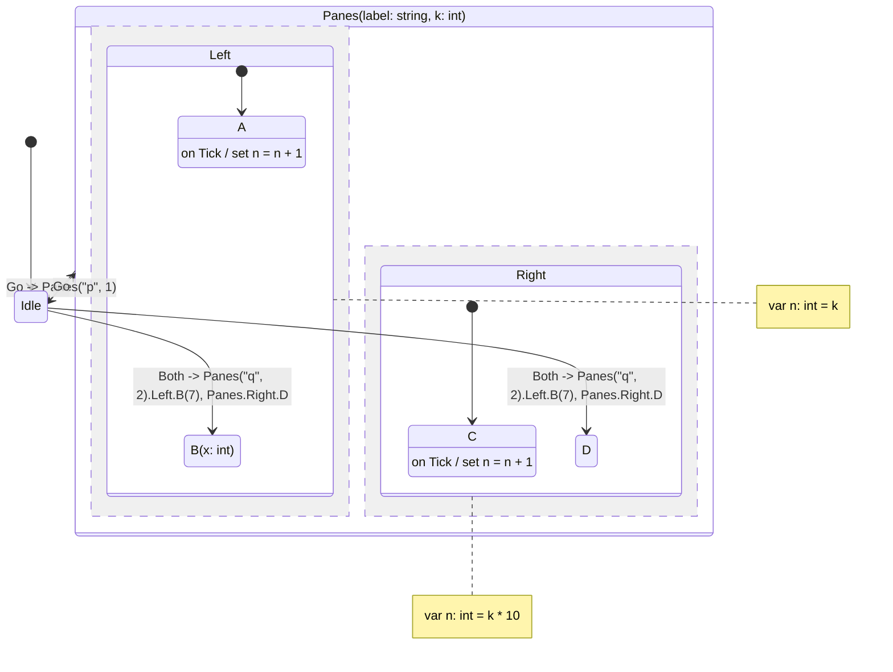

## Panels

`spec/conformance/charts/locals-regions.road:5`

```text
Regions with variables of the same name, a parallel state with parameters, and two
targets through it.
```


```mermaid
stateDiagram-v2
  state "Panes(label#58; string, k#58; int)" as Panes
  state Panes {
    state "Left" as Panes_Left
    state Panes_Left {
      state "A" as Panes_Left_A
      Panes_Left_A: on Tick / set n = n + 1
      state "B(x#58; int)" as Panes_Left_B
      [*] --> Panes_Left_A
    }
    note right of Panes_Left
      var n#58; int = k
    end note
    --
    state "Right" as Panes_Right
    state Panes_Right {
      state "C" as Panes_Right_C
      Panes_Right_C: on Tick / set n = n + 1
      state "D" as Panes_Right_D
      [*] --> Panes_Right_C
    }
    note right of Panes_Right
      var n#58; int = k * 10
    end note
  }
  [*] --> Idle
  Idle --> Panes: Go -> Panes("p", 1)
  Idle --> Panes_Left_B: Both -> Panes("q", 2).Left.B(7), Panes.Right.D
  Idle --> Panes_Right_D: Both -> Panes("q", 2).Left.B(7), Panes.Right.D
  Panes --> Idle: Go
```
