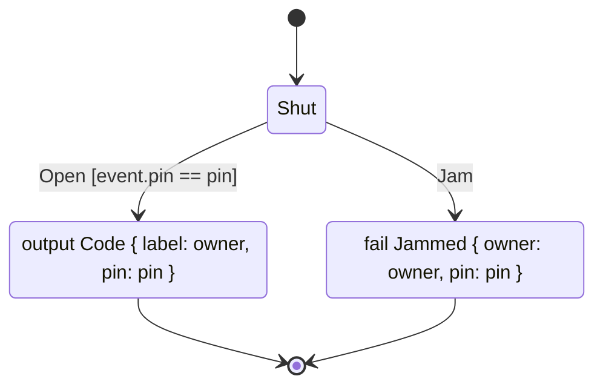
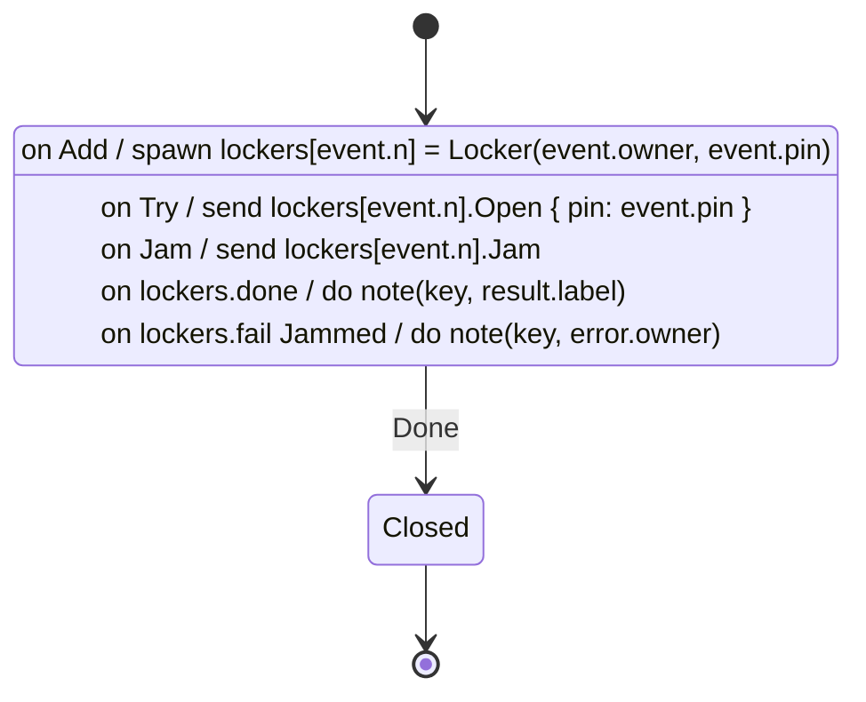

## Locker

`spec/conformance/charts/lockers.road:15`

```text
One locker, opened with its PIN.
```


```mermaid
stateDiagram-v2
  Opened: output Code { label#58; owner, pin#58; pin }
  Jammed: fail Jammed { owner#58; owner, pin#58; pin }
  [*] --> Shut
  Shut --> Opened: Open [event.pin == pin]
  Shut --> Jammed: Jam
  Opened --> [*]
  Jammed --> [*]
```

## Lockers

`spec/conformance/charts/lockers.road:29`

```text
Lockers by number.
```


```mermaid
stateDiagram-v2
  Open: on Add / spawn lockers[event.n] = Locker(event.owner, event.pin)
  Open: on Try / send lockers[event.n].Open { pin#58; event.pin }
  Open: on Jam / send lockers[event.n].Jam
  Open: on lockers.done / do note(key, result.label)
  Open: on lockers.fail Jammed / do note(key, error.owner)
  [*] --> Open
  Open --> Closed: Done
  Closed --> [*]
```
