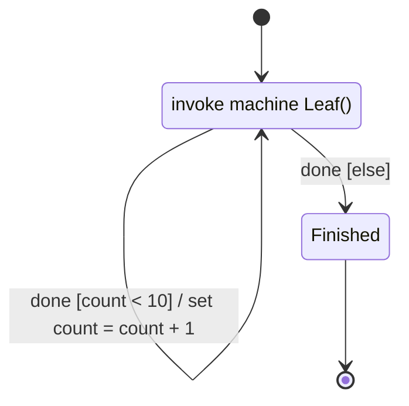
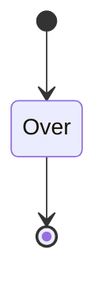

## Many

`spec/conformance/charts/many.road:5`

```text
Runs Leaf ten times.
```


```mermaid
stateDiagram-v2
  Spawning: invoke machine Leaf()
  [*] --> Spawning
  Spawning --> Spawning: done [count < 10] / set count = count + 1
  Spawning --> Finished: done [else]
  Finished --> [*]
```

## Leaf

`spec/conformance/charts/many.road:23`

```text
Ends as soon as it starts.
```


```mermaid
stateDiagram-v2
  [*] --> Over
  Over --> [*]
```
