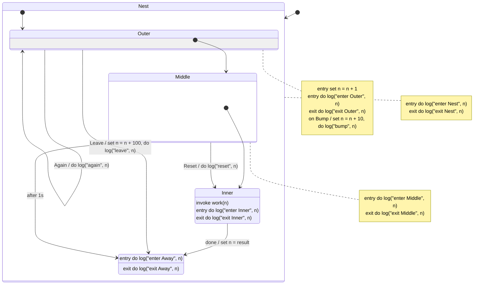

## Nest

`spec/conformance/charts/nest.road:8`

```text
Logs every entry, exit and transition effect, with the counter's value.
```


```mermaid
stateDiagram-v2
  [*] --> Nest_machine
  state "Nest" as Nest_machine
  state Nest_machine {
    state Outer {
      state "Middle" as Outer_Middle
      state Outer_Middle {
        state "Inner" as Outer_Middle_Inner
        Outer_Middle_Inner: invoke work(n)
        Outer_Middle_Inner: entry do log("enter Inner", n)
        Outer_Middle_Inner: exit do log("exit Inner", n)
        [*] --> Outer_Middle_Inner
      }
      note right of Outer_Middle
        entry do log("enter Middle", n)
        exit do log("exit Middle", n)
      end note
      [*] --> Outer_Middle
      Outer_Middle --> Outer_Middle_Inner: Reset / do log("reset", n)
    }
    note right of Outer
      entry set n = n + 1
      entry do log("enter Outer", n)
      exit do log("exit Outer", n)
      on Bump / set n = n + 10, do log("bump", n)
    end note
    Away: entry do log("enter Away", n)
    Away: exit do log("exit Away", n)
    [*] --> Outer
    Outer --> Outer: Again / do log("again", n)
    Outer --> Away: Leave / set n = n + 100, do log("leave", n)
    Outer_Middle --> Away: after 1s
    Outer_Middle_Inner --> Away: done / set n = result
  }
  note right of Nest_machine
    entry do log("enter Nest", n)
    exit do log("exit Nest", n)
  end note
```
