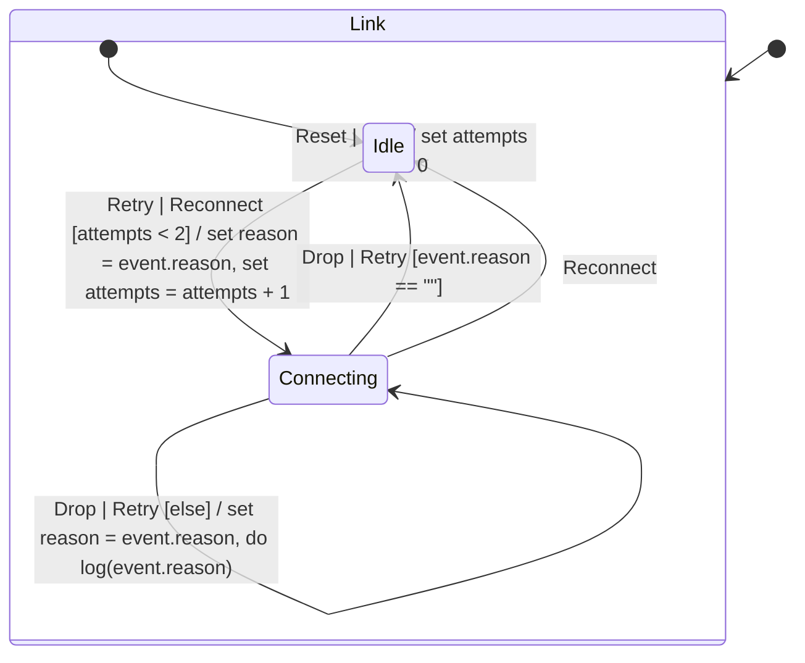

## Link

`spec/conformance/charts/or-events.road:9`

```mermaid
stateDiagram-v2
  [*] --> Link_machine
  state "Link" as Link_machine
  state Link_machine {
    [*] --> Idle
    Idle --> Connecting: Retry | Reconnect [attempts < 2] / set reason = event.reason, set attempts = attempts + 1
    Connecting --> Idle: Drop | Retry [event.reason == ""]
    Connecting --> Connecting: Drop | Retry [else] / set reason = event.reason, do log(event.reason)
    Connecting --> Idle: Reconnect
  }
  Link_machine --> Idle: Reset | Drop / set attempts = 0
```
