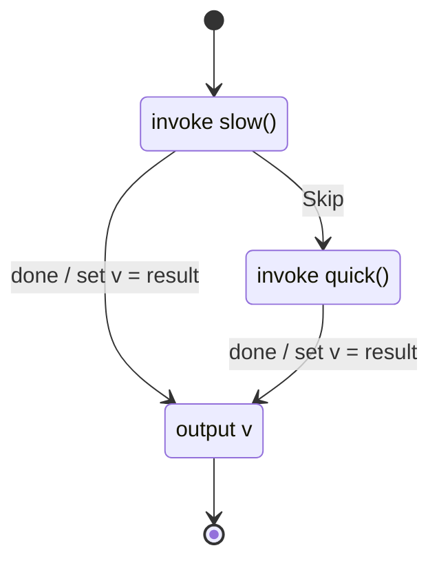

## Race

`spec/conformance/charts/race.road:7`

```text
Take whichever answer the machine is still waiting for.
```


```mermaid
stateDiagram-v2
  Slow: invoke slow()
  Quick: invoke quick()
  Finished: output v
  [*] --> Slow
  Slow --> Finished: done / set v = result
  Slow --> Quick: Skip
  Quick --> Finished: done / set v = result
  Finished --> [*]
```
