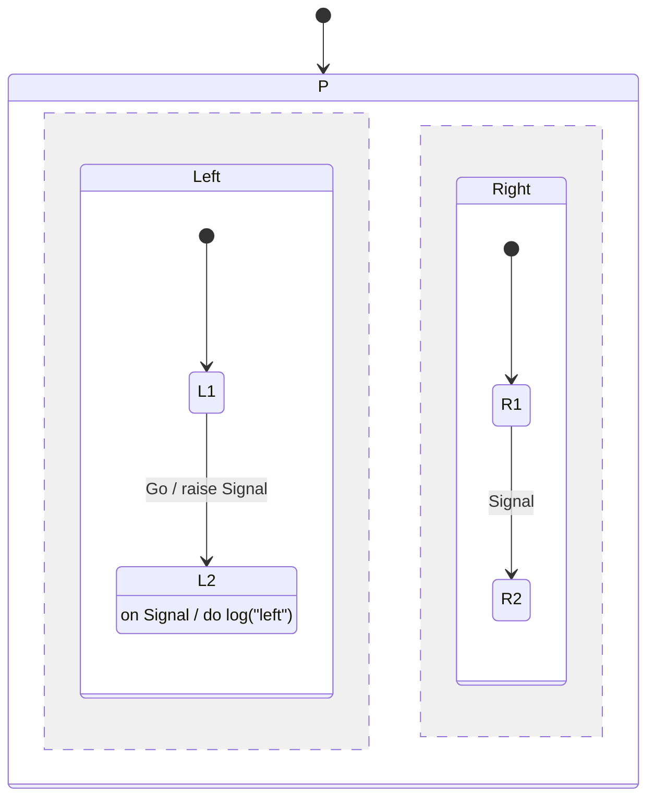

## Regions

`spec/conformance/charts/raise-regions.road:6`

```mermaid
stateDiagram-v2
  state P {
    state "Left" as P_Left
    state P_Left {
      state "L1" as P_Left_L1
      state "L2" as P_Left_L2
      P_Left_L2: on Signal / do log("left")
      [*] --> P_Left_L1
      P_Left_L1 --> P_Left_L2: Go / raise Signal
    }
    --
    state "Right" as P_Right
    state P_Right {
      state "R1" as P_Right_R1
      state "R2" as P_Right_R2
      [*] --> P_Right_R1
      P_Right_R1 --> P_Right_R2: Signal
    }
  }
  [*] --> P
```
