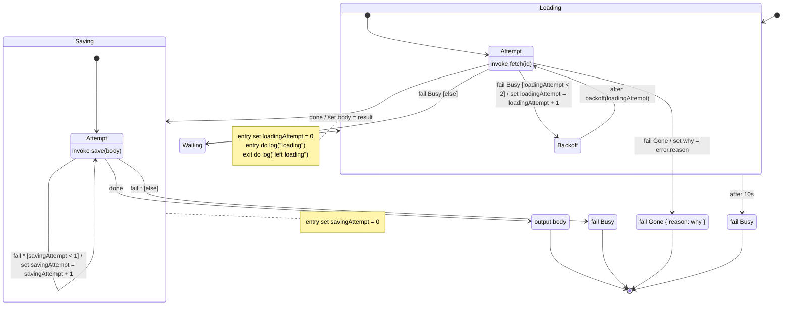

## Fetcher

`spec/conformance/charts/retry.road:12`

```text
Fetch a document with retries, then save it.
```


```mermaid
stateDiagram-v2
  state Loading {
    state "Attempt" as Loading_Attempt
    Loading_Attempt: invoke fetch(id)
    state "Backoff" as Loading_Backoff
    [*] --> Loading_Attempt
    Loading_Attempt --> Loading_Backoff: fail Busy [loadingAttempt < 2] / set loadingAttempt = loadingAttempt + 1
    Loading_Backoff --> Loading_Attempt: after backoff(loadingAttempt)
  }
  note right of Loading
    entry set loadingAttempt = 0
    entry do log("loading")
    exit do log("left loading")
  end note
  state Saving {
    state "Attempt" as Saving_Attempt
    Saving_Attempt: invoke save(body)
    [*] --> Saving_Attempt
    Saving_Attempt --> Saving_Attempt: fail * [savingAttempt < 1] / set savingAttempt = savingAttempt + 1
  }
  note right of Saving
    entry set savingAttempt = 0
  end note
  Saved: output body
  Unsaved: fail Busy
  Missing: fail Gone { reason#58; why }
  TimedOut: fail Busy
  [*] --> Loading
  Loading --> TimedOut: after 10s
  Loading_Attempt --> Saving: done / set body = result
  Loading_Attempt --> Waiting: fail Busy [else]
  Loading_Attempt --> Missing: fail Gone / set why = error.reason
  Waiting --> Loading: Again
  Saving_Attempt --> Saved: done
  Saving_Attempt --> Unsaved: fail * [else]
  Saved --> [*]
  Unsaved --> [*]
  Missing --> [*]
  TimedOut --> [*]
```
