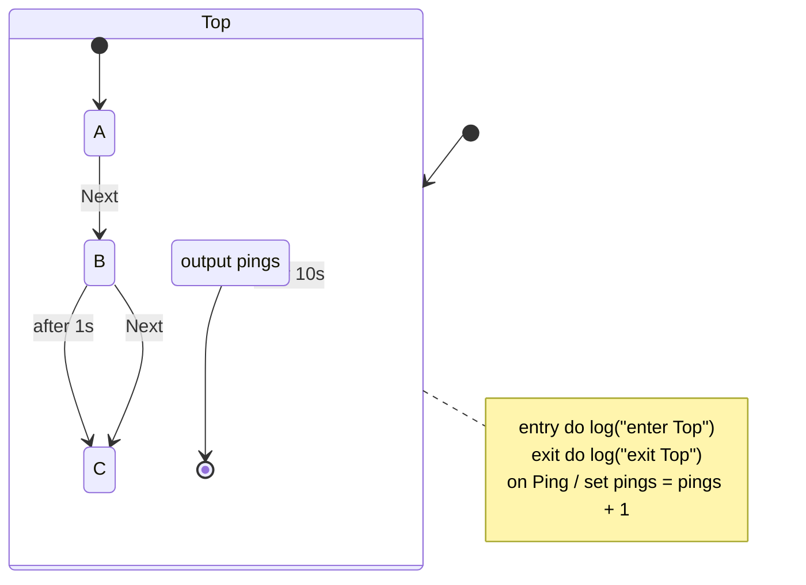

## Top

`spec/conformance/charts/root.road:7`

```text
Counts pings until the machine's own ten second timer ends it.
```


```mermaid
stateDiagram-v2
  [*] --> Top_machine
  state "Top" as Top_machine
  state Top_machine {
    Late: output pings
    [*] --> A
    A --> B: Next
    B --> C: after 1s
    B --> C: Next
    Late --> [*]
  }
  note right of Top_machine
    entry do log("enter Top")
    exit do log("exit Top")
    on Ping / set pings = pings + 1
  end note
  Top_machine --> Late: after 10s
```
