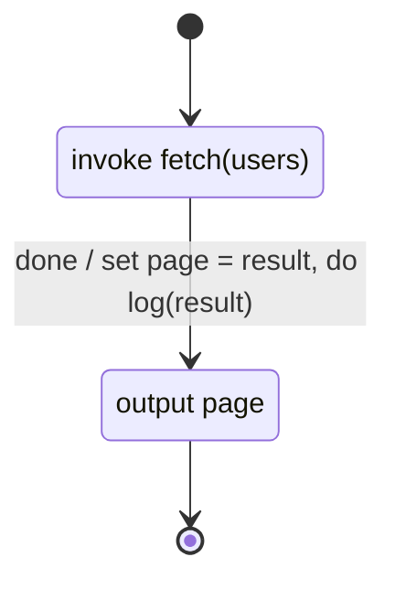

## Keep

`spec/conformance/charts/sealed.road:17`

```text
Fetches a page of the users' logins, and gives it back.
```


```mermaid
stateDiagram-v2
  Fetching: invoke fetch(users)
  Done: output page
  [*] --> Fetching
  Fetching --> Done: done / set page = result, do log(result)
  Done --> [*]
```
