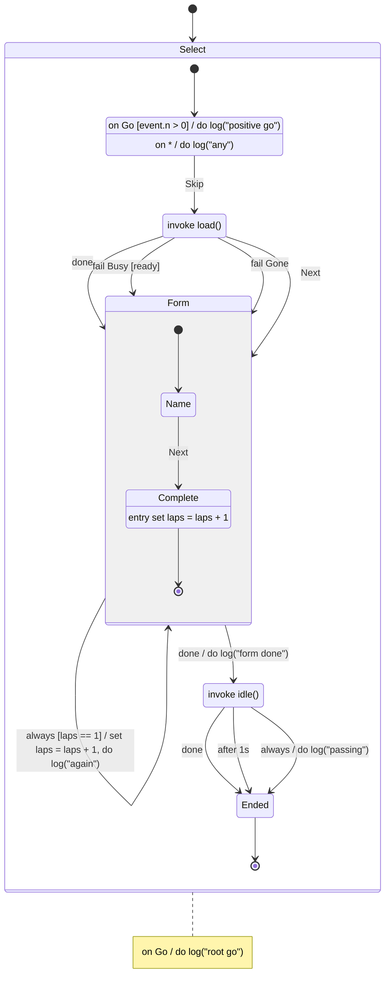

## Select

`spec/conformance/charts/select.road:13`

```text
Exercises the selection rules one event at a time.
```


```mermaid
stateDiagram-v2
  [*] --> Select_machine
  state "Select" as Select_machine
  state Select_machine {
    Picking: on Go [event.n > 0] / do log("positive go")
    Picking: on * / do log("any")
    Loading: invoke load()
    state Form {
      state "Name" as Form_Name
      state "Complete" as Form_Complete
      Form_Complete: entry set laps = laps + 1
      [*] --> Form_Name
      Form_Name --> Form_Complete: Next
      Form_Complete --> [*]
    }
    Passing: invoke idle()
    [*] --> Picking
    Picking --> Loading: Skip
    Loading --> Form: done
    Loading --> Form: fail Busy [ready]
    Loading --> Form: fail Gone
    Loading --> Form: Next
    Form --> Form: always [laps == 1] / set laps = laps + 1, do log("again")
    Form --> Passing: done / do log("form done")
    Passing --> Ended: done
    Passing --> Ended: after 1s
    Passing --> Ended: always / do log("passing")
    Ended --> [*]
  }
  note right of Select_machine
    on Go / do log("root go")
  end note
```
