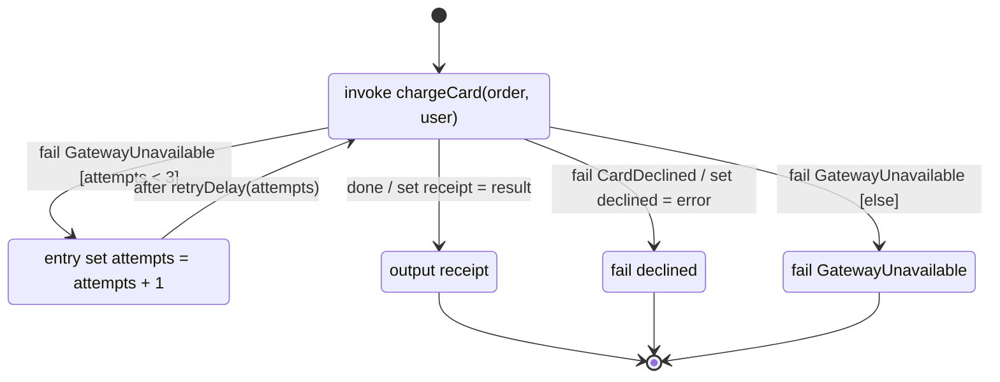

## Checkout

`spec/conformance/charts/shop/checkout.road:4`

```text
Charge the customer's card, retrying while the payment gateway is down.
```


```mermaid
stateDiagram-v2
  Charging: invoke chargeCard(order, user)
  Backoff: entry set attempts = attempts + 1
  Charged: output receipt
  Declined: fail declined
  GaveUp: fail GatewayUnavailable
  [*] --> Charging
  Charging --> Charged: done / set receipt = result
  Charging --> Declined: fail CardDeclined / set declined = error
  Charging --> Backoff: fail GatewayUnavailable [attempts < 3]
  Charging --> GaveUp: fail GatewayUnavailable [else]
  Backoff --> Charging: after retryDelay(attempts)
  Charged --> [*]
  Declined --> [*]
  GaveUp --> [*]
```
