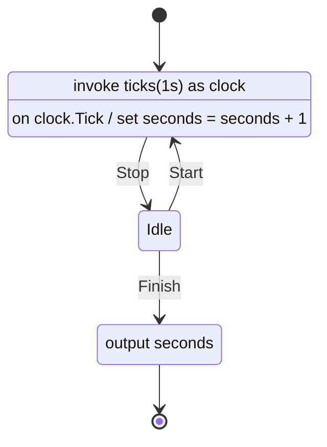

## Clock

`spec/conformance/charts/streams.road:8`

```text
Counts ticks while it waits. Can stop the clock and start it again.
```


```mermaid
stateDiagram-v2
  Waiting: invoke ticks(1s) as clock
  Waiting: on clock.Tick / set seconds = seconds + 1
  Over: output seconds
  [*] --> Waiting
  Waiting --> Idle: Stop
  Idle --> Waiting: Start
  Idle --> Over: Finish
  Over --> [*]
```
