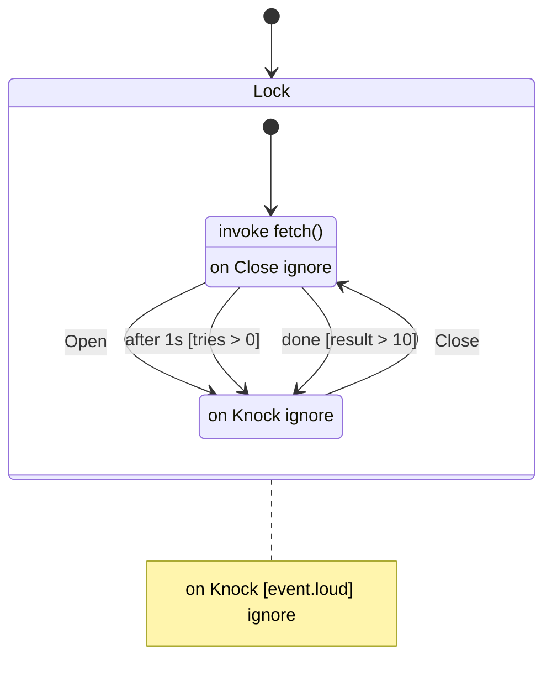

## Lock

`spec/conformance/charts/strict.road:9`

```text
Opens and closes, and takes a loud knock anywhere and a quiet one only while open.
```


```mermaid
stateDiagram-v2
  [*] --> Lock_machine
  state "Lock" as Lock_machine
  state Lock_machine {
    Closed: invoke fetch()
    Closed: on Close ignore
    Opened: on Knock ignore
    [*] --> Closed
    Closed --> Opened: Open
    Closed --> Opened: after 1s [tries > 0]
    Closed --> Opened: done [result > 10]
    Opened --> Closed: Close
  }
  note right of Lock_machine
    on Knock [event.loud] ignore
  end note
```
