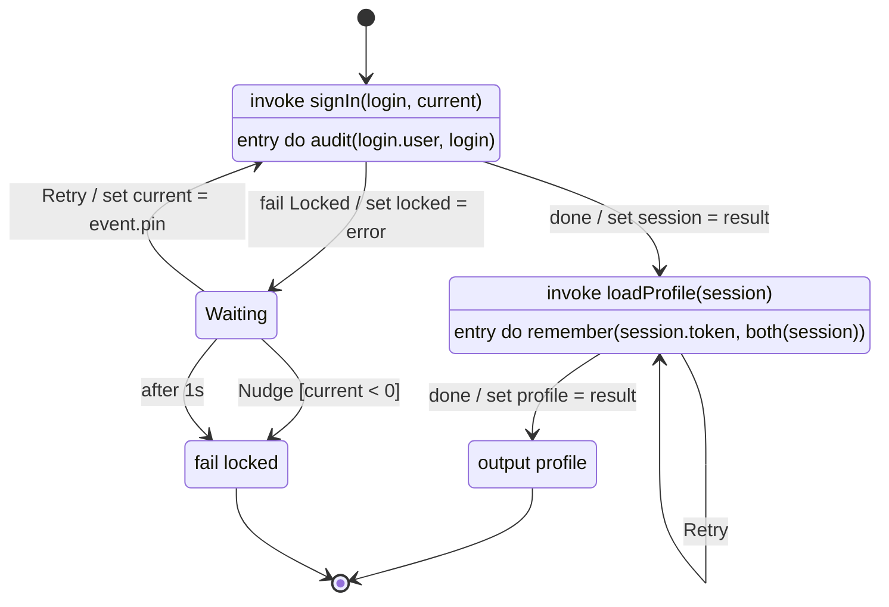

## Vault

`spec/conformance/charts/vault.road:24`

```text
Signs a user in, with a retry after a lockout, and loads their profile.
```


```mermaid
stateDiagram-v2
  SigningIn: invoke signIn(login, current)
  SigningIn: entry do audit(login.user, login)
  Loading: invoke loadProfile(session)
  Loading: entry do remember(session.token, both(session))
  Loaded: output profile
  GaveUp: fail locked
  [*] --> SigningIn
  SigningIn --> Loading: done / set session = result
  SigningIn --> Waiting: fail Locked / set locked = error
  Waiting --> SigningIn: Retry / set current = event.pin
  Waiting --> GaveUp: Nudge [current < 0]
  Waiting --> GaveUp: after 1s
  Loading --> Loaded: done / set profile = result
  Loading --> Loading: Retry
  Loaded --> [*]
  GaveUp --> [*]
```
