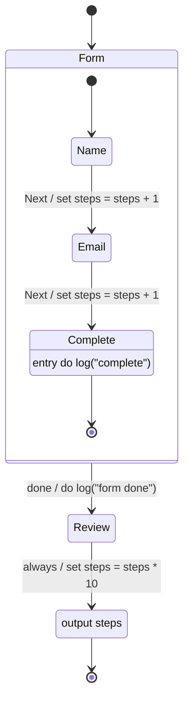

## Wizard

`spec/conformance/charts/wizard.road:7`

```text
Two steps of a form, a review that passes straight through, and a result.
```


```mermaid
stateDiagram-v2
  state Form {
    state "Name" as Form_Name
    state "Email" as Form_Email
    state "Complete" as Form_Complete
    Form_Complete: entry do log("complete")
    [*] --> Form_Name
    Form_Name --> Form_Email: Next / set steps = steps + 1
    Form_Email --> Form_Complete: Next / set steps = steps + 1
    Form_Complete --> [*]
  }
  Finished: output steps
  [*] --> Form
  Form --> Review: done / do log("form done")
  Review --> Finished: always / set steps = steps * 10
  Finished --> [*]
```
